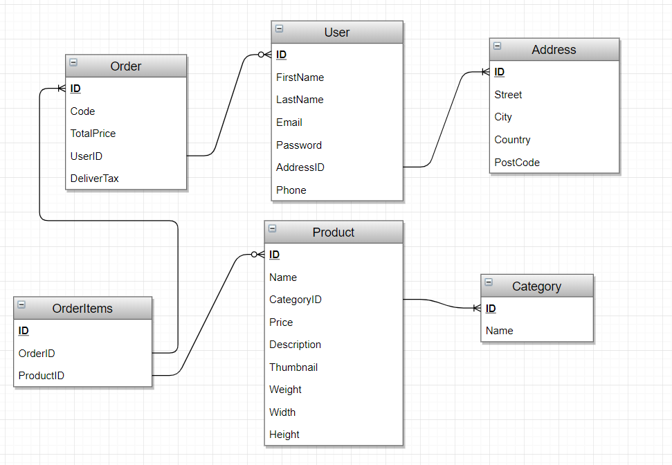

# E-COMMERCE SCHEMA ( DESIGN + SQL CODE )
---
### Basic database schema for e-commerce sites.


## What technologies that i used ?
 - [Database Design](https://www.draw.io/)
 - [SQL](https://www.google.com/search?q=sql)


## Setup prerequists
 - you have to install any [RDBMS](https://www.google.com/search?q=rdbms+list).

## Database design

#### **`NOTE:`** you can edit this design with [draw.io](https://www.draw.io/) ( just import the ``` _database design.drawio ``` file ) ..


## How to use this database 
 - Clone or download this repo.
 - Import the ``` _database source-code.sql ``` file in your RDBMS.
 - Write this command ````npm run init ``` to install dependencies.
 - Then write ``` npm run dev ``` or ``` npm run start ``` to run the app.
 - Open the app in the browser. 

#### License
---
[MIT](https://choosealicense.com/licenses/mit/)  

